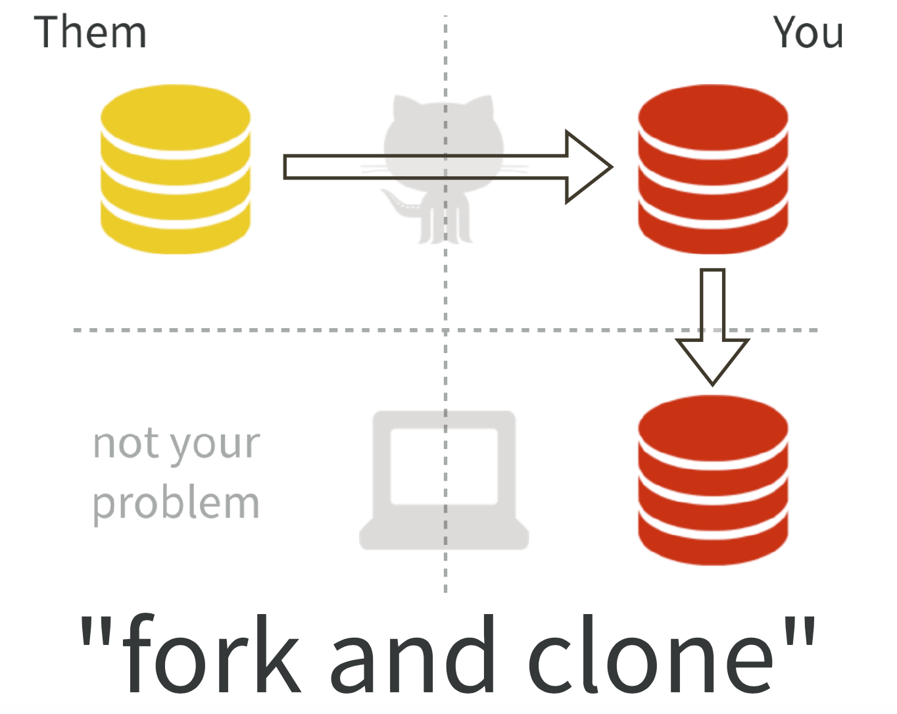

Notes--What they forgot to teach you about R
================

Set up Github connection on local shell
---------------------------------------

Make a repo on gitHub and clone it to local computer

``` r
pwd 
/Users/tma/Desktop/Training/R_conference  
git clone https://github.com/tingmar/test.git
ls
README.md
```

``` r
git remote show origin
```

> > `* remote origin`
> > `Fetch URL: https://github.com/tingmar/test.git`
> > `Push  URL: https://github.com/tingmar/test.git`
> > `HEAD branch: master`

Make some changes on the README.md file and save it and then push it to the gitHub

``` r
git add -A   
git commit -m "A commit from my local computer"   
git push
```

Reload gitHub repo and the file will be updated there.

Folk and Clone
==============

Great idea to reproduce other people's code 

How to query gitHub
===================

repo:tidyverse/tidyverse filter user:tidyverse case\_when language:r

Useful packages for file management
===================================

here: More friendly to .Rmd than file.path()

``` r
here::here()
```

    ## [1] "/Users/tma/Desktop/Training/DIY"

``` r
here::here("Output")
```

    ## [1] "/Users/tma/Desktop/Training/DIY/Output"

``` r
df <- data.frame(a=1, b="a")
write_csv(df, path=here("Output", "df.csv"))
```

fs

``` r
library(fs)
    
    dir_create("foo")
    file_create("bar")
    file_copy("test.md", "test_files/test.md", overwrite = TRUE)
    file_delete(c("bar", "test_files/test.md"))
     
    # Create a directory and put a few files in it
    files <- file_create(c("foo/bar", "foo/baz"))
    file_exists(files)
```

    ## foo/bar foo/baz 
    ##    TRUE    TRUE

``` r
    file_delete(c("foo/bar", "foo/baz"))
    dir_delete(c("foo"))
    
    
    path_file("test.md")
```

    ## test.md

``` r
    dir <- dir_create(file_temp())
    files <- file_create(path(dir, letters[1:5]))
    dir_delete(dir)
    
    dir_ls(".", recursive = TRUE, glob = "*.Rmd")
```

    ## README.Rmd test.Rmd

``` r
    dir_ls(here("test_files"), recursive = TRUE, glob = "*.md")
```

    ## character(0)

``` r
    dir_info(".")
```

    ## # A tibble: 8 x 18
    ##   path       type         size permissions modification_time   user  group
    ##   <fs::path> <fct>   <fs::byt> <fs::perms> <dttm>              <chr> <chr>
    ## 1 DIY.Rproj  file          205 rw-r--r--   2018-02-01 00:44:00 tma   staff
    ## 2 Output     direct…       102 rwxr-xr-x   2018-02-01 21:42:08 tma   staff
    ## 3 README.Rmd file        2.22K rw-r--r--   2018-02-01 23:20:31 tma   staff
    ## 4 README.md  file        3.88K rw-r--r--   2018-02-01 23:08:48 tma   staff
    ## 5 folk.png   file      210.81K rw-r--r--   2018-02-01 16:41:49 tma   staff
    ## 6 test.Rmd   file          798 rw-r--r--   2018-02-01 16:58:23 tma   staff
    ## 7 test.md    file         1007 rw-r--r--   2018-02-01 16:58:25 tma   staff
    ## 8 test_files direct…       102 rwxr-xr-x   2018-02-01 23:20:33 tma   staff
    ## # ... with 11 more variables: device_id <dbl>, hard_links <dbl>,
    ## #   special_device_id <dbl>, inode <dbl>, block_size <dbl>, blocks <dbl>,
    ## #   flags <int>, generation <dbl>, access_time <dttm>, change_time <dttm>,
    ## #   birth_time <dttm>

``` r
    path_file((here("test_files", "df.csv" )))
```

    ## df.csv

``` r
    path_dir((here("test_files", "df.csv" )))
```

    ## /Users/tma/Desktop/Training/DIY/test_files

``` r
    path_ext((here("test_files", "df.csv" )))
```

    ## csv

``` r
    path_ext("file.tar.gz")
```

    ## gz

``` r
    path_ext_remove("file.tar.gz")
```

    ## file.tar

``` r
    path_abs(here())
```

    ## [1] "/Users/tma/Desktop/Training/DIY"

``` r
    path_abs(".")
```

    ## [1] "/Users/tma/Desktop/Training/DIY"

``` r
    normalizePath("~")
```

    ## [1] "/Users/tma"

Iteration
=========

The above is located in my gitHub: <https://github.com/tingmar/DIY>

-   [Github](www.github.com)
